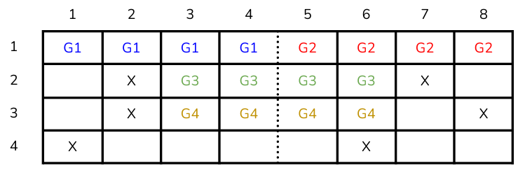
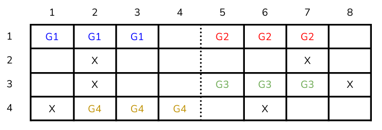
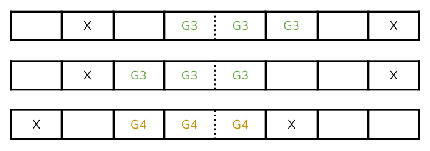

# VII CESINF ULL - Code Challenge

Desafío donde se proporcionará un problema a resolver con programación y se escogerá a uno o varios ganadores atendiendo a la calidad del código, optimización y otros factores a definir, impartido por Viren S. Dhanwani, Gabriel García Jaubert y J. Daniel Escánez, organizadores del VII Congreso de Estudiantes de Ingeniería Informática.

→ Fase de implementación: del 19 al 25 de Noviembre. Se publicará el enunciado del desafío y los participantes tendrán una semana para resolverlo.

→ Fase de corrección: del 26 de Noviembre al 2 de Diciembre.

→ Fase de resolución: el día 3 de Diciembre, durante el evento, anunciaremos los resultados del desafío y l@s ganador@s.

Recuerda que para poder participar en los talleres del VII CESINF debes ser estudiante del grado de ingeniería informática y es necesario haber comprado tu entrada a priori. Cuando se hayan confirmado estos datos se te enviará un correo de confirmación con toda la información.

## Premios

1º: Kit Raspberry Pi 400 Blanco + Cargador + Ratón

2º y 3º: Curso Udemy valorado en máximo 15€ a elección del ganador.

## Enunciado

La Escuela Superior de Ingeniería y Tecnología dispone de un Centro de Cálculo que cubre las necesidades TIC específicas del alumnado de los estudios de informática, ofreciendo acceso a puestos de ordenadores,servidores y software específico de la Ingeniería Informática.

Cada sala dentro del Centro de Cálculo tiene un número de filas *nRows*, con *nColumns* asientos cada una. Cuenta con un pasillo que suele separar los asientos en dos bloques, ubicándose entre los asientos *aisleSeat* y *aisleSeat + 1*. Sin embargo, existe también la posibilidad de que se encuentre en uno de los dos laterales, dejando las filas “intactas”.

Al entrar, vemos que ya hay sitios ocupados por otros compañeros, y tenemos varios grupos de tamaño *groupSize* que quieren entrar. Se pide calcular el número máximo de grupos de ese tamaño que caben en la sala, teniendo en cuenta que un grupo no puede dejar miembros solos (sin compañeros de su mismo grupo) en uno de los bloques separados por el pasillo.

El objetivo es implementar un método que satisfaga los tests presentes en el fichero [main.cc](./main.cc) y que tenga la siguiente forma:

```c++
int getNumberOfGroups(int nRows, int nColumns, int aisleSeat, vector<pair<int, int>> positions, int groupSize);
```

*positions* indica los asientos ocupados en la sala, y está definido con un vector que contiene en su interior pares de enteros positivos. El primer valor del par representa la fila y el segundo la columna. Los pares  que se encuentran en el vector están ordenados de menor a mayor, teniendo como criterio principal el número de la fila y después el número de la columna.

Se deben asumir las siguientes condiciones:
* 1 <= *nColumns*
* 1 <= *nRows*
* 1 < *groupSize*
* 0 <= *aisleSeat* <= *nColumns*

## Ejemplos

### Ejemplo 1

Tenemos la siguiente disposición en la sala *2.1 Ada Byron*, y llamando a la función de la siguiente manera:

```c++
getNumberOfGroups(4, 8, 4, {{2, 2}, {2, 7}, {3, 2}, {3, 8}, {4, 1}, {4, 6}}, 4);
```

Salida esperada: 4



Del resultado anterior, cabe destacar que es la única combinación posible que nos devuelve la solución correcta (a pesar de que el cálculo de la misma no es lo que se pida en el enunciado). La primera fila será ocupada de manera trivial. La segunda, puede permitir colocar a mitad del grupo en un bloque y la otra mitad en otro, dado que ningún compañero del mismo grupo se queda solo. De la misma manera ocurre en la tercera fila, y ese es el motivo también por el cual el grupo no se coloca entre las columnas 4 y 7: dejarían solo al compañero de la columna 4. Por último, en la fila 4 no se puede sentar ningún grupo, dado que si se sentaran desde la columna 2 a la 5, dejarían solo al del asiento 5.

### Ejemplo 2:

```c++
getNumberOfGroups(4, 8, 4, {{2, 2}, {2, 7}, {3, 2}, {3, 8}, {4, 1}, {4, 6}}, 3);
```

Salida esperada: 4



Esta vez, pueden existir varias combinaciones de disposiciones finales correctas, sin embargo, lo importante es el número final de grupos que caben en la sala. La primera fila es un ejemplo de esto. El Grupo 1 podría sentarse en los asientos del 1 al 3 o del 2 al 4; de manera análoga, el Grupo 2 podría sentarse en los asientos del 5 al 7 o del 6 al 8. Sin embargo, solo computan aquellos grupos que pueden sentarse a la vez; por lo tanto, en esta fila, independientemente de la combinación elegida, solo pueden sentarse como máximo 2 grupos. En la segunda fila, sin embargo, no puede sentarse ningún grupo dado que significaría dejar solo a un compañero. En las filas 3 y 4, los Grupos 3 y 4 se sientan en los únicos asientos que no implican dejar solo a un compañero.

### No Permitido:



## Información de la entrega

En este desafío deberán encontrar una solución para el problema planteado, y para ello, podrán hacer uso del lenguaje de programación que deseen.

Los códigos del enunciado y los ejemplos están escritos en C++, así como el programa principal ([main.cc](./main.cc)). Este último fichero contiene las pruebas necesarias para superar el desafío; en caso de preferir no desarrollar en C++, deberán calcar este programa escribiéndolo en el lenguaje escogido. En este fichero solamente deben editar el cuerpo de la función getNumberOfGroups, además de añadir las funciones auxiliares que consideren oportunas. Para la evaluación del código se tendrán en cuenta los siguientes aspectos:

* Consistencia en el estilo
* Cantidad de test superados
* Optimización
* Creatividad de la solución
* Estructuras de datos utilizadas
* Claridad del código

Recuerden que cualquier comentario que sirva para aclarar el código es bienvenido, ya que nos ayudará a entender la forma de pensar con la que afrontaron el problema.

¡Mucha suerte a todos!
